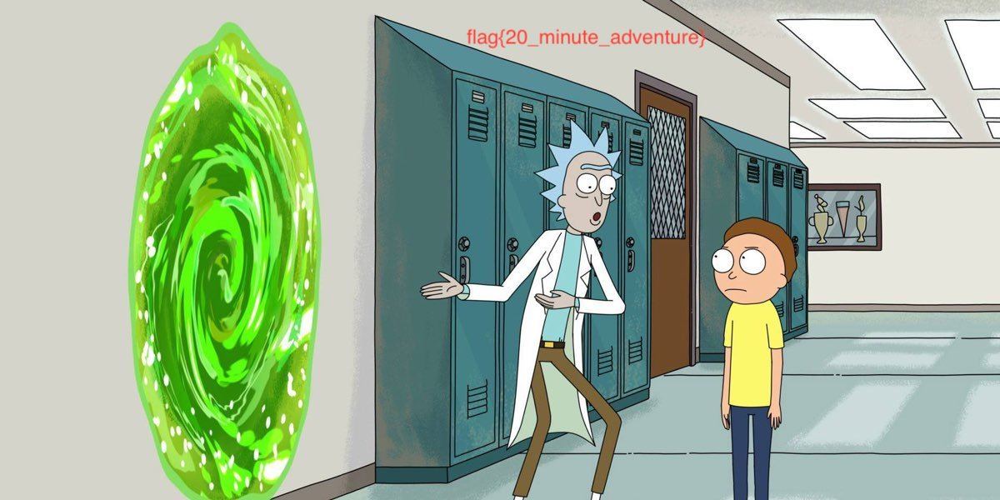

You have to open with wireshark (or any similar app) . 

Then follow the `TCP` stream. 

You will get a Rar file. Which requires a password. The Password will also be available from one of the TCP stream. 

Open the zip. You will get a png . 

Also, from the stream, you will get a raw ...which is a jpg. 

And again from another stream, you will get a stream, from which you might get another jpg.
>
Use `from hex` and then `from base 64`. And save as jpg.
https://gchq.github.io/CyberChef/#recipe=From_Hex('Auto')From_Base64('A-Za-z0-9%2B/%3D',true)

Hence all the flags are revealed. 

## flag{pickl3_NIIICK}

## flag{u_p4ss_butt3r}

## flag{20_minute_adventure}