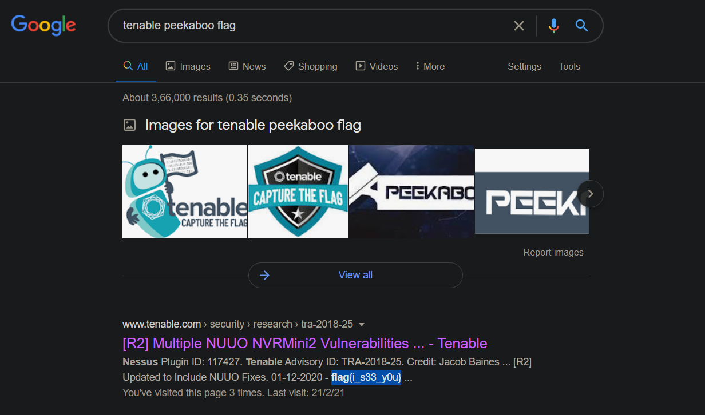

This is a really silly question. All you can do is some random google search. 

For eg:
>
    tenable ctf flag

    tenable peekaabo ctf flag

    tenable peekabo flag (you will get here the flag in the first search result)

Search result link:
https://www.google.com/search?q=tenable+peekaboo+flag&oq=tena&aqs=chrome.4.69i60j69i59l2j0i433j35i39j69i60l3.2534j0j7&sourceid=chrome&ie=UTF-8

## hurray...!!! you got the flag !!!

## flag{i_s33_y0u}