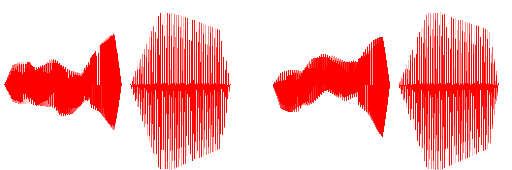

Here we are given with a **.wav** file. Let us generate a waveform of the audio.

There might be some regular pattern in the waveform. An oscilloscope might help. Here we have tried:-
https://dood.al/oscilloscope/

On uploading and playing an audio file, the flag can be observed!

## Here is your flag!

## flag{xy_voltage}