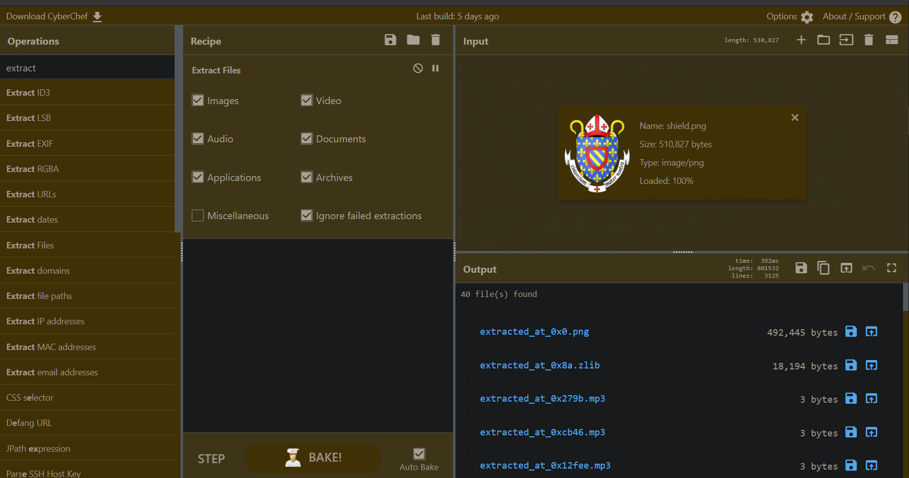
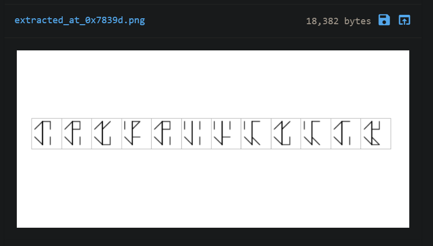
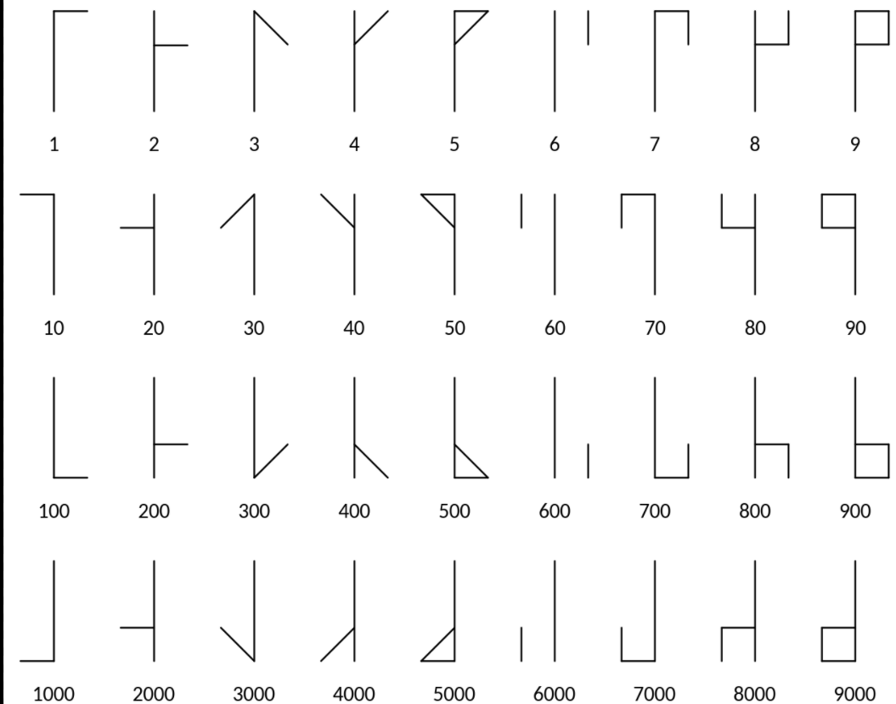

By reading the challenge statement, you may have the idea of getting another png or something. Also, something to do with the monks.

I used this for obtaining information out of the png
https://gchq.github.io/CyberChef/#recipe=Extract_Files(true,true,true,true,true,true,false,true)

Out of all the files you extracted, you might find this interesting

Now this is a cypher related to monk. 

https://www.dcode.fr/cistercian-numbers - Hope this will do the rest. 

Might be useful for you 

## flag{th0s3_m0nk5_w3r3_cl3v3r}