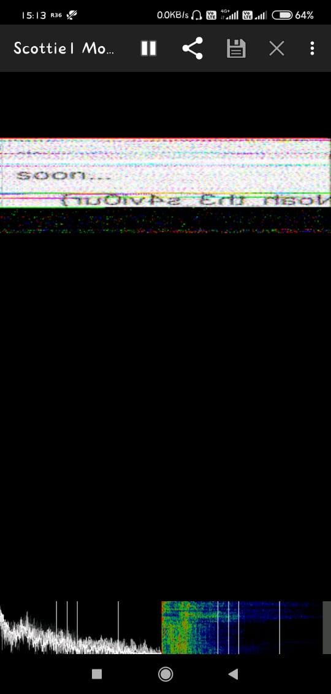

This question was based on the bot `alien` on their discord channel. 

All i have now is the video/audio clip. 

[audio](./audio.mp3)

I tried a lot of stego techniques for sound but neither was useful . 

But this one might be.  ` SSTV DECODER`

https://github.com/davidhoness/sstv_decoder - I read this article. 

Found the easiest way is to use `robot36`

Damn....!!! Its the flag.

You can see the flag now. 

## flag{Noah_th3_s4vi0ur}

