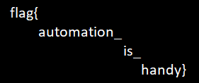

Given the link:-
http://167.71.246.232:8080/rabbit_hole.php

On opening the link, we find that a request parameter **page=cE4g5bWZtYCuovEgYSO1** has been added.
A 2 element list and some random string **(4O48APmBiNJhZBfTWMzD)** is displayed. On changing the request parameter **page** to **4O48APmBiNJhZBfTWMzD** we find that a new data gets displayed. 

On examining carefully that the 1st element of the list is some random integer and the 2nd element is the **HEX** code of some **ASCII** character. The first element must be the order in which the **HEX** codes should be sorted.

The following python program implements it:-
```py
import requests


def getUrl(page):
    return "http://167.71.246.232:8080/rabbit_hole.php?page="+page

res = ["cE4g5bWZtYCuovEgYSO1"]

for i in range(2500):
    x = requests.get(getUrl(res[-1]))
    a = int(x.text.split('\n')[0].split(' ')[0][1:-1])
    b = x.text.split('\n')[0].split(' ')[1][1:-2]
    print(i, a, b)
    id = ((x.text.split('\n'))[-1]).strip()
    res.append(id)
```

From this we will get all the keys printed. Now save the data in a txt file and run the following code:-
```py
with open('/Users/krishnendubera/Desktop/CTF/msg.txt') as f:
    l = f.read().split('\n')
    sl = []
    print(len(l))
    for i in l:
        tmp = i.split(' ')
        sl.append((int(tmp[1]), tmp[2]))
    sl.sort(key=lambda x: x[0])
    for i in sl:
        print(i[1], end=' ')

    print()
```
This will print all the **HEX** codes in order.

You can use the following web app to decode the hex string generated by the code to ascii:-
https://gchq.github.io/CyberChef/#recipe=From_Hex('Auto')

We can observe that it is a PNG file. Save the generated ascii string as a **.png** file. You will get the flag as shown below!




