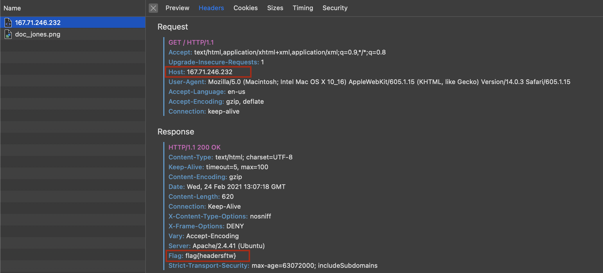

Given:-
http://167.71.246.232/

The question name itself gives us a big hint i.e. to look al the headers.

If we look at the response header of the **GET** request to the url:-
http://167.71.246.232/
we find that there is a field **Flag**

### That's it, you got the flag now!!

## flag{headersftw}