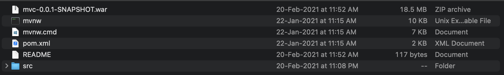

## Given:-

 - A zip file containing :-



- The following links:-

    - http://challenges.ctfd.io:30542/

    - http://challenges.ctfd.io:30541/

    - http://challenges.ctfd.io:30543/


In the src/main/java/com/tenable/ctf/mvc directory There is a file named MainController.java. There we have the following function:- 
```java
@GetMapping("/main")
        public ModelAndView getMain() {
		ModelAndView modelAndView = new ModelAndView("flag");
                modelAndView.addObject("flag", flags.getFlag("spring_mvc_1"));	// get main
                return modelAndView;
        }
```

We can now clearly see that we jave to make a get request to one of the given links with the path /main. That's is.. you got the flag!!

## flag{flag1_517d74}
