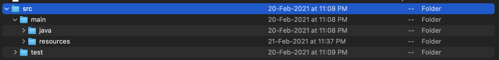
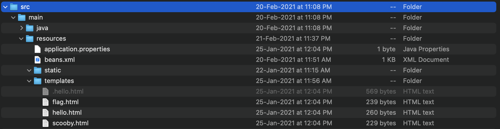

Refer to the writeup of spring_mvc_1

We have the links:-
 - http://challenges.ctfd.io:30542/
 - http://challenges.ctfd.io:30541/
 - http://challenges.ctfd.io:30543/

Now in the MainController.java we do not have any function for Spring MVC 7. Let's look for it in some other directories..

In the src/main,  we have 2 directories:-
 

Carefully looking at the resources directory, we find that there is a hidden html file resources/templates:-


On opening we find:-
```html
<!DOCTYPE HTML>
<html xmlns:th="http://www.thymeleaf.org">
<head>
    <title>Tenable CTF: Spring MVC</title>
    <meta http-equiv="Content-Type" content="text/html; charset=UTF-8" />
    <style type="text/css">
	span.hidden { color:white; }	
    </style>
</head>
<body>
	<p th:text="'Hello, ' + ${name} + '!'" />
	<p th:if="${name == 'please'}">
	<span class="hidden" th:text="${@flagService.getFlag('hidden_flag')}" />
	</p>
	<p th:if="${#session.getAttribute('realName') == 'admin'}">
	<span th:text="${#session.getAttribute('sessionFlag')}" />
	</p>
</body>
</html>
```

We can now clearly see that there is a hidden flag which is displayed whwnever the request parameter **name=please**
On making a get request to http://challenges.ctfd.io:30542/?name=please we will get our flag:-

## flag{hidden_flag_1dbc4}